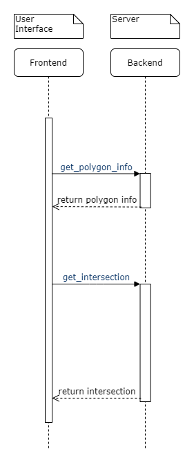

# Architecture

## Geometric library

The core logic of the app is implemented in a Python library which provides
data types for geometric primitives such as **points**, **segments** or
**polygons**.

Geometric forms are stored using [doubly connected edge lists][dcel].
This way, we can easily determine what's the inside face and the outside face
of a polygon, and perform efficient intersections.

[dcel]: https://en.wikipedia.org/wiki/Doubly_connected_edge_list

## Back end server

The back end exposes a REST API for accessing the geometric functionality,
using [Flask](https://palletsprojects.com/p/flask/).

All input data is validated before being accepted. The encoding used is
[JSON](https://www.json.org/json-en.html).

## Front end app

We provide a web-based interface for the geometric functionality.
The app uses the [React](https://reactjs.org/) framework.
Everything is broken into reusable components.
Application-level data is persisted through [Redux](https://redux.js.org/).

## Front end and Back end communication

During an online sesion the front end and back end comunicate through the API available from the server.
Here is an image with how a very short sesion looks like:

## Offline GUI

We also provide a simple Python script which imports the library and
computes the results locally. The polygons are rendered using
[`matplotlib`](https://matplotlib.org/).

By relying on `matplotlib`, the rendering function can also be imported and used
in a [Jupyter](https://jupyter.org/) Notebook.
